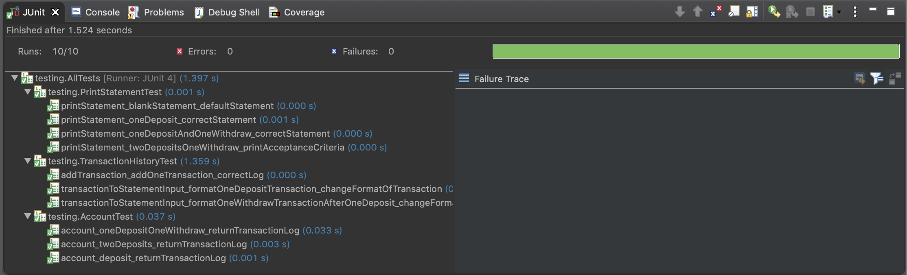
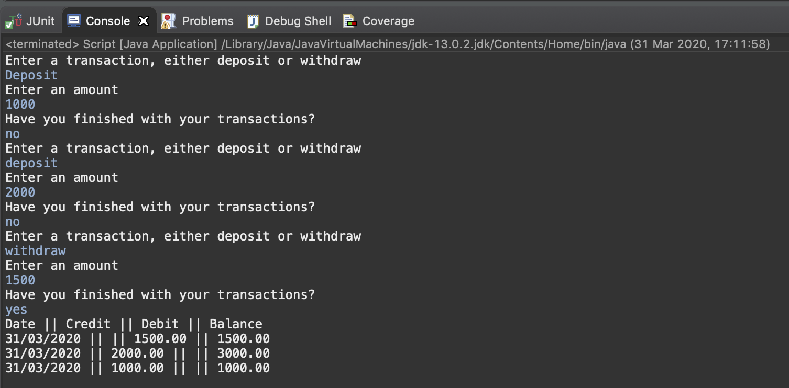

# Bank Tech Test Java

## Overview

A program ran in the terminal. Users can display their transaction history and print their statement after making deposits and withdrawals from their account.

## Requirements

- Java version 8 or higher.

## Installation

Clone the repository by typing the following command in bash

```
git clone https://github.com/Jamie95187/BankTechTestJava.git
```

Import the project into Eclipse IDE or any other Java IDE.

## Testing

Used jUnit 4 for testing. To run all the tests locate the AllTests test suite in the 'testing' directory. Tests can also be ran individually.



## Approach

I decided to have four classes for this project and followed the TDD pattern of **red, green, refactor**. I began by creating tests for the important features, which was displaying a statement in the command line.

## Running the application

The instructions will be displayed in the console. One can interact with the application by typing their desired transactions.



The image shows a run through of the application in the eclipse IDE.

## Class/Method structure

The account class adds a transaction to the transaction history log.

| Class | Methods |
| --- | --- |
| Account | deposit |
| | withdraw |

The transaction_history class stores the transactions that have been made into a log. Keeps track of the balance once the log has been updated.

| Class| Methods |
| --- | --- |
| TransactionHistory | addTransaction |
| | transactionToStatementInput |
| Getters | getLog |
| | getStatementLog |

The statement class displays the information onto the command line.

| Class| Methods |
| --- | --- |
| statement | printStatement |

The script class prints the script onto the command line. Has two helper methods and main method an entry point into the application.

| Class | Methods |
| --- | --- |
| Script | main |
| | askTransaction |
| | hasFinished |

## User Stories

```
As a user,
so that I can indulge on food
I would like to withdraw money from my account

As a user,
so that I can keep buying delicious food
I would like to deposit money into my account

As a user,
so that I can work out how much food I can buy
I would like to see how much balance I have in my account

As a user,
so that I can be sulk at my food expenditure
I would like to see a number of my most recent transactions
```

## Acceptance criteria

**Given** a client makes a deposit of 1000 on 10-01-2012  
**And** a deposit of 2000 on 13-01-2012  
**And** a withdrawal of 500 on 14-01-2012  
**When** she prints her bank statement  
**Then** she would see

```
date || credit || debit || balance
14/01/2012 || || 500.00 || 2500.00
13/01/2012 || 2000.00 || || 3000.0
10/01/2012 || 1000.00 || || 1000.00
```
